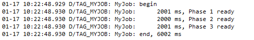

# Logger-Wrapper

## What it solve?

1. log filter will not be block during library release.

    You can use `log.debug(boolean)` to modify the debug/release switch.

    By default, it use library's BuildConfig.DEBUG, but it set `publishNonDefault true` in the gradle. So you can change buildType in gradle (See 2).

2. zero config or don't worry about duplicate config.

    Using this library, you can simply config the debug/release state in gradle by using

    ``` groovy
    debugCompile project(path: ':logger-wrapper', configuration: 'debug')
    releaseCompile project(path: ':logger-wrapper', configuration: 'release')
    ```

    When you need to log, using `Logger.tag(Your_Tag)` to get the log instance. I recommend to store the instance in class level.

    Also, you can get the same one from `Logger.tag(Your_Tag)`, Logger will store all the log instance in ArrayMap (So it depend on support-compat's `ArrayMap`).

    If you has some config to do with the log instance, such as default log level and release's log filter, you can repeat to do it, they are lightweight.

    If you want to use custom log implement, you can use `log.bind(AbstractLog)` to add a custom log. It is similar with `Timber.plant`.
    We use LinkedList to ensure they execute following the order they bind, but I hope you `will not` depend on this.
    You can check whether the log instance is exist by using `Logger.isExist(Your_Tag)`.

    You can create a LogFactory for config the log instance and get it from the LogFactory (See the sample).

    If you want to provide the ability of log trace for user, you can expose the debug option to the user.

3. optimized android log as default log implement and support log thread name, source jump, time measure.

4. smart `log(...)` function.

## Architecture Design


1. Logger store logs by Map, every Log instance create by tag and has default log level and release's log filter.

2. Log has stable basic tag and a local tag for once use. Thread info, source jump also log when call them directly.

3. Log also provide TimingLogger but only control the log filter and log priority. So you will not expect to get the same TimingLogger instance from Log.

## What it look like?




## Other questions

1. Support line wrapper?

    No. You can use `Soft Wraps`.

2. Striking decoration?

    No. You can see the sample for how to use Logger as the default Log implement.

## Get start

